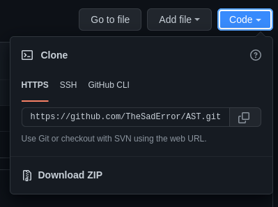

# AST
Azərbaycan Statistika Təşkilatı (Azerbaijan Statistics Team)

You can plot a graph using AST quickly and easily . AST supports 3 languages yet. Azerbaijani | Turkish | English . You may ask :           
```There is excel for graphs why we will use AST?```  . It is so easy to answear. There is many reasons to use AST.

```
1. AST Is Quicker
2. AST Is Open Source
3. AST Is Upgrading Every Day/Week
4. AST Has Many Options To Create A Graph
And the last one is : AST Is Azerbaijanian Tool.
We think these reasons are enough to use AST.
```
And please dont forget to star and fork our project after use it.
# Installation

## Install in Linux & Mac (Debian/Arch)
```sh
git clone https://github.com/TheSadError/AST
cd AST
pip install -r requirements.txt
python3 ast.py
```

## Install in Windows (Win 7,8,10,,11)

<div>
  <p align="center">
     
  </p>
</div>

Press download zip. Then you will have zip folder. Extract it. Then open cmd. Cd the folder directory. After write **pip install - r requirements.txt**. You will requirements packets for run *AST* . After it finished final command is : **python ast.py** . There it is!

## Contact
```
Join Discord Group : 
Error's Discord    : err0r#4018
Januie's Discord   : Jan20🇦🇿#6757
```

## Explanation
[Explain](https://github.com/TheSadError/AST/blob/main/Explanation.md)

# Copright
**© 2022 AST Coded by Error & Januie! Please dont copy our code and dont forget to put our names when you share it!**
